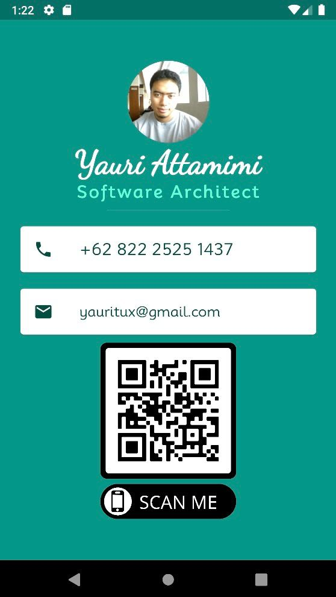

# my_business_card

A simple demo on flutter application (iOS + Android) for my personal business card.

## Getting Started

1. Clone this repository or open it up directly from your Android Studio.
2. Setup your virtual emulator (Android / iOS). For help getting started with Flutter development, view the
   [online documentation](https://docs.flutter.dev/).
3. Run the application using the emulator you had setup in your AndroidStudio, you'll get something like what depicted on the picture below.

## Other Resources on Flutter

- [Lab: Write your first Flutter app](https://docs.flutter.dev/get-started/codelab)
- [Cookbook: Useful Flutter samples](https://docs.flutter.dev/cookbook)
